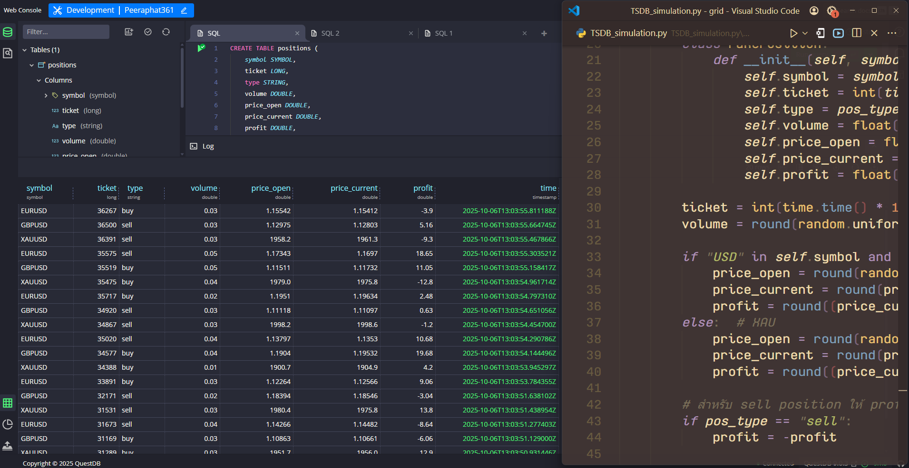

# 🚀 การจำลอง TSDB ด้วย QuestDB

[](https://www.python.org/) 
[](https://questdb.io/)

โปรเจกต์นี้เป็นการจำลอง **MT5 positions** (Buy/Sell) สำหรับหลายสัญลักษณ์ เช่น EURUSD, GBPUSD, XAUUSD ไปยัง **QuestDB** โดยใช้ **line protocol** และ **multipart/form-data**  

รองรับ **multi-threading** เพื่อจำลองหลายสัญลักษณ์พร้อมกันแบบเรียลไทม์

---

## 📸 ตัวอย่าง



---

## 🔹 ตารางสัญลักษณ์ที่จำลอง

| สัญลักษณ์ | คำอธิบาย             |
|------------|---------------------|
| EURUSD     | Forex คู่ยูโร/ดอลลาร์ |
| GBPUSD     | Forex คู่ปอนด์/ดอลลาร์ |
| XAUUSD     | ทองคำ/ดอลลาร์สหรัฐ   |

---

## ✨ ฟีเจอร์

- จำลอง MT5 positions แบบหลาย thread
- รองรับหลายสัญลักษณ์ (Forex / Gold)
- ส่งข้อมูล positions แบบเรียลไทม์ไปยัง QuestDB
- ใช้ `multipart/form-data` สำหรับ HTTP ingestion (จำเป็นสำหรับ QuestDB)

---

## ⚙️ สิ่งที่ต้องติดตั้ง

- Python 3.9+
- ไลบรารี `requests` (`pip install requests`)
- QuestDB รันบน `http://localhost:9000`

---

## 📝 วิธีใช้งาน

1. รัน QuestDB ให้พร้อมใช้งาน
2. สร้างตารางใน QuestDB:

```sql
CREATE TABLE positions (
    symbol SYMBOL CAPACITY 256 CACHE,
    ticket LONG,
    type STRING,
    volume DOUBLE,
    price_open DOUBLE,
    price_current DOUBLE,
    profit DOUBLE,
    time TIMESTAMP
) TIMESTAMP(time) PARTITION BY NONE;
